# Техническая архитектура Dubai Cons AI Suite

## 🏗️ Обзор архитектуры

Dubai Cons AI Suite построена на микросервисной архитектуре с использованием современных технологий ИИ, облачных решений и API-ориентированного подхода.

## 🎯 Архитектурные принципы

### Основные принципы
- **Микросервисная архитектура**: Независимые сервисы для каждого модуля
- **API-First**: Все взаимодействие через RESTful API
- **Cloud-Native**: Полная облачная архитектура
- **Scalable**: Горизонтальное масштабирование
- **Resilient**: Высокая отказоустойчивость
- **Secure**: Многоуровневая безопасность

### Технологические принципы
- **Event-Driven**: Асинхронная обработка событий
- **Data-Driven**: Принятие решений на основе данных
- **AI-First**: ИИ в основе всех процессов
- **Mobile-First**: Приоритет мобильных устройств
- **Progressive Web App**: Современные веб-технологии

## 🏛️ Высокоуровневая архитектура

```mermaid
graph TB
    subgraph "Frontend Layer"
        WEB[Web Application]
        MOBILE[Mobile App]
        VR[VR Application]
    end
    
    subgraph "API Gateway"
        GATEWAY[API Gateway]
        AUTH[Authentication]
        RATE[Rate Limiting]
    end
    
    subgraph "Microservices"
        DESIGN[Design AI Service]
        VIZ[Visualization Service]
        DOC[Documentation Service]
        EST[Estimation Service]
        SOURCE[Sourcing Service]
        PROJECT[Project Management Service]
        CLIENT[Client Service]
    end
    
    subgraph "AI Layer"
        OPENAI[OpenAI API]
        STABILITY[Stability AI]
        CUSTOM[Custom AI Models]
        ML[ML Pipeline]
    end
    
    subgraph "Data Layer"
        POSTGRES[(PostgreSQL)]
        REDIS[(Redis Cache)]
        S3[(Object Storage)]
        VECTOR[(Vector DB)]
    end
    
    subgraph "External Services"
        BIM[BIM APIs]
        SUPPLIERS[Supplier APIs]
        PAYMENT[Payment Gateways]
        NOTIFICATION[Notification Services]
    end
    
    WEB --> GATEWAY
    MOBILE --> GATEWAY
    VR --> GATEWAY
    
    GATEWAY --> AUTH
    GATEWAY --> RATE
    GATEWAY --> DESIGN
    GATEWAY --> VIZ
    GATEWAY --> DOC
    GATEWAY --> EST
    GATEWAY --> SOURCE
    GATEWAY --> PROJECT
    GATEWAY --> CLIENT
    
    DESIGN --> OPENAI
    DESIGN --> CUSTOM
    VIZ --> STABILITY
    VIZ --> CUSTOM
    DOC --> OPENAI
    EST --> ML
    SOURCE --> SUPPLIERS
    PROJECT --> BIM
    
    DESIGN --> POSTGRES
    VIZ --> S3
    DOC --> POSTGRES
    EST --> POSTGRES
    SOURCE --> REDIS
    PROJECT --> POSTGRES
    CLIENT --> POSTGRES
    
    DESIGN --> VECTOR
    VIZ --> VECTOR
    CLIENT --> VECTOR
```



## 🔧 Технологический стек

### Backend Technologies
```python
tech_stack = {
    "framework": "FastAPI 0.104+",
    "language": "Python 3.10.11",
    "async": "asyncio, aiohttp",
    "database": {
        "primary": "PostgreSQL 14+",
        "cache": "Redis 7+",
        "vector": "Pinecone / Weaviate",
        "object_storage": "AWS S3 / MinIO"
    },
    "ai_ml": {
        "frameworks": ["TensorFlow 2.15", "PyTorch 2.1", "Transformers 4.35"],
        "apis": ["OpenAI API", "Stability AI", "Hugging Face"],
        "processing": ["NumPy", "Pandas", "Scikit-learn"]
    },
    "3d_rendering": {
        "engines": ["Blender API", "Unreal Engine 5"],
        "formats": ["GLTF", "FBX", "OBJ"],
        "libraries": ["Open3D", "Trimesh"]
    },
    "vr_ar": {
        "web": "WebXR",
        "mobile": "Unity 3D",
        "desktop": "OpenVR"
    }
}
```

### Frontend Technologies
```javascript
frontend_stack = {
    "web": {
        "framework": "React 18 + TypeScript",
        "state": "Redux Toolkit + RTK Query",
        "ui": "Material-UI / Ant Design",
        "3d": "Three.js + React Three Fiber",
        "vr": "WebXR + A-Frame"
    },
    "mobile": {
        "framework": "React Native",
        "state": "Redux Toolkit",
        "ui": "NativeBase",
        "vr": "Unity 3D"
    },
    "desktop": {
        "framework": "Electron",
        "vr": "Unity 3D + OpenVR"
    }
}
```

### Infrastructure
```yaml
infrastructure:
  cloud_provider: "AWS / Azure"
  containerization: "Docker + Kubernetes"
  orchestration: "Helm Charts"
  monitoring: "Prometheus + Grafana"
  logging: "ELK Stack"
  ci_cd: "GitHub Actions / GitLab CI"
  cdn: "CloudFlare"
  security: "WAF + DDoS Protection"
```

## 🎨 Микросервисы

### 1. Design AI Service
**Назначение**: Генерация дизайн-концепций с использованием ИИ

```python
# src/api/design_service.py
from fastapi import FastAPI, HTTPException
from pydantic import BaseModel
from typing import List, Dict, Any
import asyncio

app = FastAPI(title="Design AI Service", version="1.0.0")

class DesignRequest(BaseModel):
    client_preferences: Dict[str, Any]
    space_constraints: Dict[str, Any]
    budget_constraints: Dict[str, Any]
    style_preferences: List[str]

class DesignResponse(BaseModel):
    concepts: List[Dict[str, Any]]
    recommendations: Dict[str, Any]
    confidence_scores: Dict[str, float]

@app.post("/api/v1/design/generate-concepts")
async def generate_concepts(request: DesignRequest) -> DesignResponse:
    """
    Генерация множественных дизайн-концепций на основе ИИ
    """
    try:
        # Анализ предпочтений клиента
        style_analysis = await analyze_style_preferences(request.client_preferences)
        
        # Генерация концепций
        concepts = await generate_design_concepts(
            style_analysis, 
            request.space_constraints,
            request.budget_constraints
        )
        
        # Создание рекомендаций
        recommendations = await create_recommendations(concepts, request.style_preferences)
        
        return DesignResponse(
            concepts=concepts,
            recommendations=recommendations,
            confidence_scores=calculate_confidence_scores(concepts)
        )
        
    except Exception as e:
        raise HTTPException(status_code=500, detail=str(e))

@app.post("/api/v1/design/personalize")
async def personalize_design(
    concept_id: str,
    personalization_data: Dict[str, Any]
) -> Dict[str, Any]:
    """
    Персонализация существующей концепции
    """
    # Реализация персонализации
    pass

@app.get("/api/v1/design/concepts/{concept_id}")
async def get_concept(concept_id: str) -> Dict[str, Any]:
    """
    Получение детальной информации о концепции
    """
    # Реализация получения концепции
    pass
```

### 2. Visualization Service
**Назначение**: Создание 3D-визуализации и VR-туров

```python
# src/api/visualization_service.py
from fastapi import FastAPI, BackgroundTasks
from pydantic import BaseModel
import asyncio

app = FastAPI(title="Visualization Service", version="1.0.0")

class VisualizationRequest(BaseModel):
    design_data: Dict[str, Any]
    materials_data: Dict[str, Any]
    quality_settings: Dict[str, Any]

class VisualizationResponse(BaseModel):
    task_id: str
    status: str
    estimated_completion: str

@app.post("/api/v1/viz/create-3d-model")
async def create_3d_model(
    request: VisualizationRequest,
    background_tasks: BackgroundTasks
) -> VisualizationResponse:
    """
    Создание 3D-модели на основе дизайн-данных
    """
    task_id = generate_task_id()
    
    # Запуск фоновой задачи
    background_tasks.add_task(
        process_3d_model_creation,
        task_id,
        request.design_data,
        request.materials_data,
        request.quality_settings
    )
    
    return VisualizationResponse(
        task_id=task_id,
        status="processing",
        estimated_completion="2-4 hours"
    )

@app.post("/api/v1/viz/create-vr-tour")
async def create_vr_tour(
    model_id: str,
    tour_settings: Dict[str, Any]
) -> VisualizationResponse:
    """
    Создание VR-тура на основе 3D-модели
    """
    # Реализация создания VR-тура
    pass

@app.get("/api/v1/viz/task/{task_id}/status")
async def get_task_status(task_id: str) -> Dict[str, Any]:
    """
    Получение статуса задачи визуализации
    """
    # Реализация получения статуса
    pass
```

### 3. Documentation Service
**Назначение**: Автоматическая генерация проектной документации

```python
# src/api/documentation_service.py
from fastapi import FastAPI
from pydantic import BaseModel
import asyncio

app = FastAPI(title="Documentation Service", version="1.0.0")

class DocumentationRequest(BaseModel):
    project_data: Dict[str, Any]
    client_requirements: Dict[str, Any]
    compliance_standards: List[str]

@app.post("/api/v1/docs/generate-project-docs")
async def generate_project_docs(request: DocumentationRequest) -> Dict[str, Any]:
    """
    Генерация полного пакета проектной документации
    """
    # Генерация технического задания
    technical_spec = await generate_technical_specification(
        request.project_data,
        request.client_requirements
    )
    
    # Генерация чертежей
    drawings = await generate_drawings(request.project_data)
    
    # Генерация спецификаций
    specifications = await generate_specifications(
        request.project_data,
        request.compliance_standards
    )
    
    return {
        "technical_specification": technical_spec,
        "drawings": drawings,
        "specifications": specifications,
        "compliance_check": await check_compliance(specifications)
    }

@app.post("/api/v1/docs/analyze-existing")
async def analyze_existing_docs(files: List[str]) -> Dict[str, Any]:
    """
    Анализ существующих документов клиента
    """
    # OCR для извлечения текста
    extracted_data = await extract_text_from_docs(files)
    
    # Анализ планировки
    layout_analysis = await analyze_layout(extracted_data)
    
    # Выявление ограничений
    constraints = await identify_constraints(extracted_data)
    
    return {
        "extracted_data": extracted_data,
        "layout_analysis": layout_analysis,
        "constraints": constraints
    }
```

### 4. Estimation Service
**Назначение**: Автоматические расчеты смет и оптимизация бюджета

```python
# src/api/estimation_service.py
from fastapi import FastAPI
from pydantic import BaseModel
from typing import Dict, List, Any

app = FastAPI(title="Estimation Service", version="1.0.0")

class EstimationRequest(BaseModel):
    project_data: Dict[str, Any]
    materials_data: Dict[str, Any]
    labor_rates: Dict[str, float]
    location: str

class EstimationResponse(BaseModel):
    materials_cost: float
    labor_cost: float
    overhead_cost: float
    total_cost: float
    breakdown: Dict[str, Any]
    suppliers: List[Dict[str, Any]]

@app.post("/api/v1/estimation/calculate")
async def calculate_estimate(request: EstimationRequest) -> EstimationResponse:
    """
    Расчет детальной сметы проекта
    """
    # Расчет объемов работ
    work_volumes = await calculate_volumes(request.project_data)
    
    # Расчет стоимости материалов
    materials_cost = await calculate_materials_cost(
        work_volumes,
        request.materials_data,
        request.location
    )
    
    # Расчет стоимости работ
    labor_cost = await calculate_labor_cost(
        work_volumes,
        request.labor_rates,
        request.location
    )
    
    # Накладные расходы
    overhead_cost = await calculate_overhead(materials_cost, labor_cost)
    
    # Поиск поставщиков
    suppliers = await find_suppliers(request.materials_data, request.location)
    
    return EstimationResponse(
        materials_cost=materials_cost,
        labor_cost=labor_cost,
        overhead_cost=overhead_cost,
        total_cost=materials_cost + labor_cost + overhead_cost,
        breakdown=work_volumes,
        suppliers=suppliers
    )

@app.post("/api/v1/estimation/optimize-budget")
async def optimize_budget(
    budget_constraint: float,
    project_requirements: Dict[str, Any]
) -> Dict[str, Any]:
    """
    Оптимизация проекта под бюджет
    """
    # Анализ приоритетов
    priorities = await analyze_client_priorities(project_requirements)
    
    # Поиск альтернатив
    alternatives = await find_alternatives(priorities, budget_constraint)
    
    # Расчет экономии
    savings_analysis = await calculate_savings(alternatives)
    
    return {
        "alternatives": alternatives,
        "savings": savings_analysis,
        "recommendations": await generate_recommendations(alternatives)
    }
```

### 5. Sourcing Service
**Назначение**: Поиск материалов и оптимизация цепочки поставок

```python
# src/api/sourcing_service.py
from fastapi import FastAPI
from pydantic import BaseModel
from typing import List, Dict, Any

app = FastAPI(title="Sourcing Service", version="1.0.0")

class SourcingRequest(BaseModel):
    material_specifications: Dict[str, Any]
    budget_constraints: Dict[str, Any]
    timeline_constraints: Dict[str, Any]
    location: str

@app.post("/api/v1/sourcing/find-materials")
async def find_materials(request: SourcingRequest) -> Dict[str, Any]:
    """
    Поиск материалов по спецификациям
    """
    # Поиск в базе поставщиков Дубая
    suppliers = await search_dubai_suppliers(
        request.material_specifications,
        request.location
    )
    
    # Сравнение цен и сроков
    price_comparison = await compare_prices(suppliers)
    
    # Проверка наличия
    availability_check = await check_availability(suppliers)
    
    # Рекомендации
    recommendations = await generate_recommendations(
        price_comparison,
        availability_check,
        request.budget_constraints
    )
    
    return {
        "suppliers": suppliers,
        "price_comparison": price_comparison,
        "availability": availability_check,
        "recommendations": recommendations
    }

@app.post("/api/v1/sourcing/optimize-supply-chain")
async def optimize_supply_chain(
    project_timeline: Dict[str, Any],
    material_requirements: Dict[str, Any]
) -> Dict[str, Any]:
    """
    Оптимизация цепочки поставок
    """
    # Планирование закупок
    procurement_plan = await plan_procurement(
        material_requirements,
        project_timeline
    )
    
    # Оптимизация логистики
    logistics_optimization = await optimize_logistics(procurement_plan)
    
    # Управление рисками
    risk_analysis = await analyze_supply_risks(logistics_optimization)
    
    return {
        "procurement_plan": procurement_plan,
        "logistics": logistics_optimization,
        "risk_analysis": risk_analysis
    }
```

### 6. Project Management Service
**Назначение**: Управление проектами и мониторинг прогресса

```python
# src/api/project_service.py
from fastapi import FastAPI
from pydantic import BaseModel
from typing import Dict, List, Any

app = FastAPI(title="Project Management Service", version="1.0.0")

class ProjectRequest(BaseModel):
    project_data: Dict[str, Any]
    resources: Dict[str, Any]
    constraints: Dict[str, Any]

@app.post("/api/v1/project/create-plan")
async def create_project_plan(request: ProjectRequest) -> Dict[str, Any]:
    """
    Создание плана проекта с ИИ-оптимизацией
    """
    # Анализ зависимостей задач
    task_dependencies = await analyze_dependencies(request.project_data['tasks'])
    
    # Оптимизация расписания
    optimized_schedule = await optimize_schedule(
        task_dependencies,
        request.resources,
        request.constraints
    )
    
    # Планирование ресурсов
    resource_allocation = await allocate_resources(
        optimized_schedule,
        request.resources
    )
    
    # Анализ рисков
    risk_assessment = await assess_risks(optimized_schedule, resource_allocation)
    
    return {
        "schedule": optimized_schedule,
        "resource_allocation": resource_allocation,
        "risk_assessment": risk_assessment,
        "milestones": await define_milestones(optimized_schedule)
    }

@app.post("/api/v1/project/monitor-progress")
async def monitor_progress(
    project_id: str,
    real_time_data: Dict[str, Any]
) -> Dict[str, Any]:
    """
    Мониторинг прогресса в реальном времени
    """
    # Анализ текущего состояния
    current_status = await analyze_current_status(real_time_data)
    
    # Прогнозирование завершения
    completion_forecast = await forecast_completion(current_status, project_id)
    
    # Выявление отклонений
    deviations = await detect_deviations(current_status, project_id)
    
    # Рекомендации по корректировке
    recommendations = await generate_corrections(deviations)
    
    return {
        "current_status": current_status,
        "forecast": completion_forecast,
        "deviations": deviations,
        "recommendations": recommendations
    }
```

### 7. Client Service
**Назначение**: Работа с клиентами и персонализация

```python
# src/api/client_service.py
from fastapi import FastAPI
from pydantic import BaseModel
from typing import Dict, Any

app = FastAPI(title="Client Service", version="1.0.0")

class ClientProfileRequest(BaseModel):
    client_data: Dict[str, Any]
    interaction_history: Dict[str, Any]

@app.post("/api/v1/client/analyze-profile")
async def analyze_client_profile(request: ClientProfileRequest) -> Dict[str, Any]:
    """
    Анализ профиля клиента для персонализации
    """
    # Определение сегмента клиента
    client_segment = await classify_client_segment(request.client_data)
    
    # Анализ предпочтений
    preferences = await analyze_preferences(request.interaction_history)
    
    # Оценка бюджета
    budget_estimation = await estimate_budget(request.client_data, client_segment)
    
    # Рекомендации по подходу
    approach_recommendations = await recommend_approach(
        client_segment,
        preferences
    )
    
    return {
        "segment": client_segment,
        "preferences": preferences,
        "budget_estimation": budget_estimation,
        "approach": approach_recommendations
    }

@app.post("/api/v1/client/generate-proposal")
async def generate_proposal(
    client_profile: Dict[str, Any],
    project_requirements: Dict[str, Any]
) -> Dict[str, Any]:
    """
    Генерация персонализированного предложения
    """
    # Адаптация под сегмент клиента
    tailored_solution = await tailor_solution(client_profile, project_requirements)
    
    # Создание презентации
    presentation = await create_presentation(tailored_solution)
    
    # Расчет ROI для клиента
    roi_analysis = await calculate_roi(tailored_solution, client_profile)
    
    return {
        "solution": tailored_solution,
        "presentation": presentation,
        "roi_analysis": roi_analysis
    }
```

## 🗄️ База данных

### Схема базы данных

```sql
-- Основные таблицы
CREATE TABLE clients (
    id UUID PRIMARY KEY DEFAULT gen_random_uuid(),
    name VARCHAR(255) NOT NULL,
    email VARCHAR(255) UNIQUE NOT NULL,
    phone VARCHAR(50),
    client_type VARCHAR(50) NOT NULL, -- luxury, commercial, renovation
    budget_range JSONB,
    preferences JSONB,
    created_at TIMESTAMP DEFAULT NOW(),
    updated_at TIMESTAMP DEFAULT NOW()
);

CREATE TABLE projects (
    id UUID PRIMARY KEY DEFAULT gen_random_uuid(),
    client_id UUID REFERENCES clients(id),
    name VARCHAR(255) NOT NULL,
    description TEXT,
    project_type VARCHAR(50) NOT NULL,
    status VARCHAR(50) DEFAULT 'draft',
    budget DECIMAL(15,2),
    timeline JSONB,
    requirements JSONB,
    created_at TIMESTAMP DEFAULT NOW(),
    updated_at TIMESTAMP DEFAULT NOW()
);

CREATE TABLE design_concepts (
    id UUID PRIMARY KEY DEFAULT gen_random_uuid(),
    project_id UUID REFERENCES projects(id),
    name VARCHAR(255) NOT NULL,
    concept_data JSONB NOT NULL,
    visualizations JSONB,
    materials JSONB,
    cost_estimate DECIMAL(15,2),
    confidence_score DECIMAL(3,2),
    created_at TIMESTAMP DEFAULT NOW()
);

CREATE TABLE materials (
    id UUID PRIMARY KEY DEFAULT gen_random_uuid(),
    name VARCHAR(255) NOT NULL,
    category VARCHAR(100) NOT NULL,
    specifications JSONB,
    supplier_id UUID,
    price DECIMAL(10,2),
    availability VARCHAR(50),
    location VARCHAR(100),
    created_at TIMESTAMP DEFAULT NOW()
);

CREATE TABLE suppliers (
    id UUID PRIMARY KEY DEFAULT gen_random_uuid(),
    name VARCHAR(255) NOT NULL,
    contact_info JSONB,
    specialties TEXT[],
    location VARCHAR(100),
    rating DECIMAL(3,2),
    created_at TIMESTAMP DEFAULT NOW()
);

CREATE TABLE project_tasks (
    id UUID PRIMARY KEY DEFAULT gen_random_uuid(),
    project_id UUID REFERENCES projects(id),
    name VARCHAR(255) NOT NULL,
    description TEXT,
    status VARCHAR(50) DEFAULT 'pending',
    priority VARCHAR(20) DEFAULT 'medium',
    estimated_duration INTEGER, -- в днях
    actual_duration INTEGER,
    dependencies UUID[],
    assigned_to UUID,
    created_at TIMESTAMP DEFAULT NOW(),
    updated_at TIMESTAMP DEFAULT NOW()
);

-- Индексы для оптимизации
CREATE INDEX idx_clients_type ON clients(client_type);
CREATE INDEX idx_projects_status ON projects(status);
CREATE INDEX idx_projects_client ON projects(client_id);
CREATE INDEX idx_concepts_project ON design_concepts(project_id);
CREATE INDEX idx_materials_category ON materials(category);
CREATE INDEX idx_tasks_project ON project_tasks(project_id);
CREATE INDEX idx_tasks_status ON project_tasks(status);

-- Полнотекстовый поиск
CREATE INDEX idx_materials_search ON materials USING gin(to_tsvector('english', name || ' ' || COALESCE(specifications::text, '')));
```

## 🔐 Безопасность

### Аутентификация и авторизация

```python
# src/auth/security.py
from fastapi import Depends, HTTPException, status
from fastapi.security import HTTPBearer, HTTPAuthorizationCredentials
from jose import JWTError, jwt
from passlib.context import CryptContext
import os

security = HTTPBearer()
pwd_context = CryptContext(schemes=["bcrypt"], deprecated="auto")

SECRET_KEY = os.getenv("SECRET_KEY")
ALGORITHM = "HS256"
ACCESS_TOKEN_EXPIRE_MINUTES = 30

def verify_password(plain_password: str, hashed_password: str) -> bool:
    return pwd_context.verify(plain_password, hashed_password)

def get_password_hash(password: str) -> str:
    return pwd_context.hash(password)

def create_access_token(data: dict) -> str:
    to_encode = data.copy()
    expire = datetime.utcnow() + timedelta(minutes=ACCESS_TOKEN_EXPIRE_MINUTES)
    to_encode.update({"exp": expire})
    encoded_jwt = jwt.encode(to_encode, SECRET_KEY, algorithm=ALGORITHM)
    return encoded_jwt

async def get_current_user(credentials: HTTPAuthorizationCredentials = Depends(security)):
    credentials_exception = HTTPException(
        status_code=status.HTTP_401_UNAUTHORIZED,
        detail="Could not validate credentials",
        headers={"WWW-Authenticate": "Bearer"},
    )
    
    try:
        payload = jwt.decode(credentials.credentials, SECRET_KEY, algorithms=[ALGORITHM])
        username: str = payload.get("sub")
        if username is None:
            raise credentials_exception
    except JWTError:
        raise credentials_exception
    
    user = await get_user(username)
    if user is None:
        raise credentials_exception
    return user
```

### Защита данных

```python
# src/security/data_protection.py
from cryptography.fernet import Fernet
import hashlib
import os

class DataProtection:
    def __init__(self):
        self.key = os.getenv("ENCRYPTION_KEY")
        self.cipher = Fernet(self.key)
    
    def encrypt_sensitive_data(self, data: str) -> str:
        """Шифрование чувствительных данных"""
        return self.cipher.encrypt(data.encode()).decode()
    
    def decrypt_sensitive_data(self, encrypted_data: str) -> str:
        """Расшифровка чувствительных данных"""
        return self.cipher.decrypt(encrypted_data.encode()).decode()
    
    def hash_personal_data(self, data: str) -> str:
        """Хеширование персональных данных"""
        return hashlib.sha256(data.encode()).hexdigest()
    
    def anonymize_data(self, data: dict) -> dict:
        """Анонимизация данных для аналитики"""
        anonymized = data.copy()
        sensitive_fields = ['email', 'phone', 'address']
        
        for field in sensitive_fields:
            if field in anonymized:
                anonymized[field] = self.hash_personal_data(anonymized[field])
        
        return anonymized
```

## 📊 Мониторинг и логирование

### Система мониторинга

```python
# src/monitoring/metrics.py
from prometheus_client import Counter, Histogram, Gauge, start_http_server
import time
import functools

# Метрики для мониторинга
REQUEST_COUNT = Counter('api_requests_total', 'Total API requests', ['method', 'endpoint', 'status'])
REQUEST_DURATION = Histogram('api_request_duration_seconds', 'API request duration')
ACTIVE_CONNECTIONS = Gauge('active_connections', 'Number of active connections')
AI_MODEL_LATENCY = Histogram('ai_model_latency_seconds', 'AI model inference latency', ['model_name'])

def monitor_requests(func):
    """Декоратор для мониторинга API запросов"""
    @functools.wraps(func)
    async def wrapper(*args, **kwargs):
        start_time = time.time()
        try:
            result = await func(*args, **kwargs)
            REQUEST_COUNT.labels(
                method=kwargs.get('method', 'unknown'),
                endpoint=kwargs.get('endpoint', 'unknown'),
                status='success'
            ).inc()
            return result
        except Exception as e:
            REQUEST_COUNT.labels(
                method=kwargs.get('method', 'unknown'),
                endpoint=kwargs.get('endpoint', 'unknown'),
                status='error'
            ).inc()
            raise
        finally:
            REQUEST_DURATION.observe(time.time() - start_time)
    return wrapper

def start_monitoring():
    """Запуск сервера метрик"""
    start_http_server(8000)
```

### Логирование

```python
# src/logging/logger.py
import logging
import json
from datetime import datetime
from typing import Dict, Any

class JSONFormatter(logging.Formatter):
    def format(self, record):
        log_entry = {
            'timestamp': datetime.utcnow().isoformat(),
            'level': record.levelname,
            'logger': record.name,
            'message': record.getMessage(),
            'module': record.module,
            'function': record.funcName,
            'line': record.lineno
        }
        
        if hasattr(record, 'extra_data'):
            log_entry['extra_data'] = record.extra_data
        
        if record.exc_info:
            log_entry['exception'] = self.formatException(record.exc_info)
        
        return json.dumps(log_entry)

def setup_logging():
    """Настройка системы логирования"""
    logger = logging.getLogger()
    logger.setLevel(logging.INFO)
    
    # Консольный хендлер
    console_handler = logging.StreamHandler()
    console_handler.setFormatter(JSONFormatter())
    logger.addHandler(console_handler)
    
    # Файловый хендлер
    file_handler = logging.FileHandler('app.log')
    file_handler.setFormatter(JSONFormatter())
    logger.addHandler(file_handler)
    
    return logger
```

## 🚀 Развертывание

### Docker конфигурация

```dockerfile
# Dockerfile
FROM python:3.10.11-slim

WORKDIR /app

# Установка системных зависимостей
RUN apt-get update && apt-get install -y \
    gcc \
    g++ \
    libpq-dev \
    && rm -rf /var/lib/apt/lists/*

# Копирование requirements
COPY requirements.txt .
RUN pip install --no-cache-dir -r requirements.txt

# Копирование кода
COPY . .

# Создание пользователя
RUN useradd --create-home --shell /bin/bash app
USER app

# Запуск приложения
CMD ["uvicorn", "main:app", "--host", "0.0.0.0", "--port", "8000"]
```

### Kubernetes манифесты

```yaml
# k8s/deployment.yaml
apiVersion: apps/v1
kind: Deployment
metadata:
  name: dubai-cons-ai-suite
spec:
  replicas: 3
  selector:
    matchLabels:
      app: dubai-cons-ai-suite
  template:
    metadata:
      labels:
        app: dubai-cons-ai-suite
    spec:
      containers:
      - name: api
        image: dubai-cons-ai-suite:latest
        ports:
        - containerPort: 8000
        env:
        - name: DATABASE_URL
          valueFrom:
            secretKeyRef:
              name: db-secret
              key: url
        - name: REDIS_URL
          valueFrom:
            secretKeyRef:
              name: redis-secret
              key: url
        resources:
          requests:
            memory: "512Mi"
            cpu: "250m"
          limits:
            memory: "1Gi"
            cpu: "500m"
        livenessProbe:
          httpGet:
            path: /health
            port: 8000
          initialDelaySeconds: 30
          periodSeconds: 10
        readinessProbe:
          httpGet:
            path: /ready
            port: 8000
          initialDelaySeconds: 5
          periodSeconds: 5
---
apiVersion: v1
kind: Service
metadata:
  name: dubai-cons-ai-suite-service
spec:
  selector:
    app: dubai-cons-ai-suite
  ports:
  - port: 80
    targetPort: 8000
  type: LoadBalancer
```

---

*Документ создан: Октябрь 2024*  
*Версия: 1.0*  
*Статус: Утверждено*
