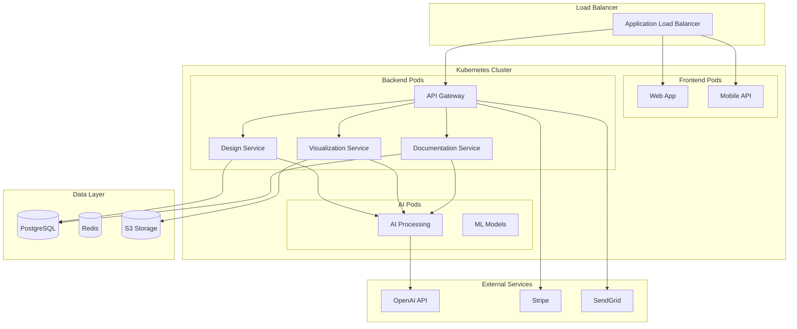

# Развертывание Dubai Cons AI Suite

## 🚀 Обзор развертывания

Dubai Cons AI Suite развертывается в облачной среде с использованием современных DevOps практик, обеспечивающих высокую доступность, масштабируемость и безопасность.

## 🏗️ Архитектура развертывания

### Облачная инфраструктура
- **Основное облако**: AWS (предпочтительно) или Azure
- **CDN**: CloudFlare для глобального распространения контента
- **Мониторинг**: Prometheus + Grafana + ELK Stack
- **CI/CD**: GitHub Actions или GitLab CI
- **Контейнеризация**: Docker + Kubernetes

### Компоненты системы


## 🐳 Docker конфигурация

### Основной Dockerfile
```dockerfile
# Dockerfile
FROM python:3.10.11-slim

# Установка системных зависимостей
RUN apt-get update && apt-get install -y \
    gcc \
    g++ \
    libpq-dev \
    libgl1-mesa-glx \
    libglib2.0-0 \
    libsm6 \
    libxext6 \
    libxrender-dev \
    libgomp1 \
    && rm -rf /var/lib/apt/lists/*

# Создание рабочей директории
WORKDIR /app

# Копирование файлов зависимостей
COPY requirements.txt .
COPY requirements-dev.txt .

# Установка Python зависимостей
RUN pip install --no-cache-dir -r requirements.txt

# Копирование исходного кода
COPY . .

# Создание пользователя для безопасности
RUN useradd --create-home --shell /bin/bash app && \
    chown -R app:app /app
USER app

# Переменные окружения
ENV PYTHONPATH=/app
ENV PYTHONUNBUFFERED=1

# Проверка здоровья
HEALTHCHECK --interval=30s --timeout=30s --start-period=5s --retries=3 \
    CMD curl -f http://localhost:8000/health || exit 1

# Запуск приложения
CMD ["uvicorn", "main:app", "--host", "0.0.0.0", "--port", "8000", "--workers", "4"]
```

### Docker Compose для разработки
```yaml
# docker-compose.yml
version: '3.8'

services:
  # Основное приложение
  app:
    build: .
    ports:
      - "8000:8000"
    environment:
      - DATABASE_URL=postgresql://postgres:password@db:5432/dubaicons
      - REDIS_URL=redis://redis:6379/0
      - OPENAI_API_KEY=${OPENAI_API_KEY}
      - STABILITY_AI_API_KEY=${STABILITY_AI_API_KEY}
    depends_on:
      - db
      - redis
    volumes:
      - ./src:/app/src
      - ./storage:/app/storage
    command: uvicorn main:app --host 0.0.0.0 --port 8000 --reload

  # База данных PostgreSQL
  db:
    image: postgres:14
    environment:
      - POSTGRES_DB=dubaicons
      - POSTGRES_USER=postgres
      - POSTGRES_PASSWORD=password
    ports:
      - "5432:5432"
    volumes:
      - postgres_data:/var/lib/postgresql/data
      - ./scripts/init.sql:/docker-entrypoint-initdb.d/init.sql

  # Redis для кэширования
  redis:
    image: redis:7-alpine
    ports:
      - "6379:6379"
    volumes:
      - redis_data:/data

  # Nginx для статических файлов
  nginx:
    image: nginx:alpine
    ports:
      - "80:80"
    volumes:
      - ./nginx.conf:/etc/nginx/nginx.conf
      - ./static:/usr/share/nginx/html
    depends_on:
      - app

  # Мониторинг
  prometheus:
    image: prom/prometheus
    ports:
      - "9090:9090"
    volumes:
      - ./prometheus.yml:/etc/prometheus/prometheus.yml
      - prometheus_data:/prometheus

  grafana:
    image: grafana/grafana
    ports:
      - "3000:3000"
    environment:
      - GF_SECURITY_ADMIN_PASSWORD=admin
    volumes:
      - grafana_data:/var/lib/grafana

volumes:
  postgres_data:
  redis_data:
  prometheus_data:
  grafana_data:
```

## ☸️ Kubernetes конфигурация

### Namespace
```yaml
# k8s/namespace.yaml
apiVersion: v1
kind: Namespace
metadata:
  name: dubaicons-ai-suite
  labels:
    name: dubaicons-ai-suite
    environment: production
```

### ConfigMap
```yaml
# k8s/configmap.yaml
apiVersion: v1
kind: ConfigMap
metadata:
  name: dubaicons-config
  namespace: dubaicons-ai-suite
data:
  APP_NAME: "Dubai Cons AI Suite"
  APP_VERSION: "1.0.0"
  LOG_LEVEL: "INFO"
  CORS_ORIGINS: "https://app.dubaicons.ai,https://admin.dubaicons.ai"
  UPLOAD_MAX_SIZE: "100MB"
  SESSION_TIMEOUT: "3600"
```

### Secrets
```yaml
# k8s/secrets.yaml
apiVersion: v1
kind: Secret
metadata:
  name: dubaicons-secrets
  namespace: dubaicons-ai-suite
type: Opaque
data:
  # Base64 encoded values
  database-url: cG9zdGdyZXNxbDovL3VzZXI6cGFzc0BkYjozNDMyL2RhdGFiYXNl
  redis-url: cmVkaXM6Ly9yZWRpczozNjM5LzA=
  openai-api-key: c2stYWJjZGVmZ2hpams=
  stability-ai-api-key: c2stbG1ub3BxcnN0dXY=
  stripe-secret-key: c2tfdGVzdF8xMjM0NTY3ODk=
  sendgrid-api-key: U0cuYWJjZGVmZ2hpams=
```

### Deployment для API
```yaml
# k8s/api-deployment.yaml
apiVersion: apps/v1
kind: Deployment
metadata:
  name: dubaicons-api
  namespace: dubaicons-ai-suite
  labels:
    app: dubaicons-api
spec:
  replicas: 3
  selector:
    matchLabels:
      app: dubaicons-api
  template:
    metadata:
      labels:
        app: dubaicons-api
    spec:
      containers:
      - name: api
        image: dubaicons-ai-suite:latest
        ports:
        - containerPort: 8000
        env:
        - name: DATABASE_URL
          valueFrom:
            secretKeyRef:
              name: dubaicons-secrets
              key: database-url
        - name: REDIS_URL
          valueFrom:
            secretKeyRef:
              name: dubaicons-secrets
              key: redis-url
        - name: OPENAI_API_KEY
          valueFrom:
            secretKeyRef:
              name: dubaicons-secrets
              key: openai-api-key
        resources:
          requests:
            memory: "512Mi"
            cpu: "250m"
          limits:
            memory: "1Gi"
            cpu: "500m"
        livenessProbe:
          httpGet:
            path: /health
            port: 8000
          initialDelaySeconds: 30
          periodSeconds: 10
        readinessProbe:
          httpGet:
            path: /ready
            port: 8000
          initialDelaySeconds: 5
          periodSeconds: 5
        volumeMounts:
        - name: storage
          mountPath: /app/storage
      volumes:
      - name: storage
        persistentVolumeClaim:
          claimName: storage-pvc
```

### Service
```yaml
# k8s/api-service.yaml
apiVersion: v1
kind: Service
metadata:
  name: dubaicons-api-service
  namespace: dubaicons-ai-suite
spec:
  selector:
    app: dubaicons-api
  ports:
  - port: 80
    targetPort: 8000
  type: ClusterIP
```

### Ingress
```yaml
# k8s/ingress.yaml
apiVersion: networking.k8s.io/v1
kind: Ingress
metadata:
  name: dubaicons-ingress
  namespace: dubaicons-ai-suite
  annotations:
    kubernetes.io/ingress.class: nginx
    cert-manager.io/cluster-issuer: letsencrypt-prod
    nginx.ingress.kubernetes.io/ssl-redirect: "true"
    nginx.ingress.kubernetes.io/rate-limit: "100"
    nginx.ingress.kubernetes.io/rate-limit-window: "1m"
spec:
  tls:
  - hosts:
    - api.dubaicons.ai
    - app.dubaicons.ai
    secretName: dubaicons-tls
  rules:
  - host: api.dubaicons.ai
    http:
      paths:
      - path: /
        pathType: Prefix
        backend:
          service:
            name: dubaicons-api-service
            port:
              number: 80
  - host: app.dubaicons.ai
    http:
      paths:
      - path: /
        pathType: Prefix
        backend:
          service:
            name: dubaicons-web-service
            port:
              number: 80
```

### PersistentVolumeClaim
```yaml
# k8s/storage.yaml
apiVersion: v1
kind: PersistentVolumeClaim
metadata:
  name: storage-pvc
  namespace: dubaicons-ai-suite
spec:
  accessModes:
    - ReadWriteMany
  resources:
    requests:
      storage: 100Gi
  storageClassName: aws-efs
```

## 🔧 Helm Charts

### Chart.yaml
```yaml
# helm/dubaicons-ai-suite/Chart.yaml
apiVersion: v2
name: dubaicons-ai-suite
description: Dubai Cons AI Suite - Professional AI tool for architecture and construction
type: application
version: 1.0.0
appVersion: "1.0.0"
dependencies:
- name: postgresql
  version: 12.1.2
  repository: https://charts.bitnami.com/bitnami
- name: redis
  version: 17.3.7
  repository: https://charts.bitnami.com/bitnami
```

### values.yaml
```yaml
# helm/dubaicons-ai-suite/values.yaml
replicaCount: 3

image:
  repository: dubaicons-ai-suite
  tag: latest
  pullPolicy: IfNotPresent

service:
  type: ClusterIP
  port: 80

ingress:
  enabled: true
  className: nginx
  annotations:
    cert-manager.io/cluster-issuer: letsencrypt-prod
  hosts:
    - host: api.dubaicons.ai
      paths:
        - path: /
          pathType: Prefix
  tls:
    - secretName: dubaicons-tls
      hosts:
        - api.dubaicons.ai

resources:
  limits:
    cpu: 500m
    memory: 1Gi
  requests:
    cpu: 250m
    memory: 512Mi

autoscaling:
  enabled: true
  minReplicas: 3
  maxReplicas: 10
  targetCPUUtilizationPercentage: 70
  targetMemoryUtilizationPercentage: 80

postgresql:
  enabled: true
  auth:
    postgresPassword: "postgres"
    database: "dubaicons"
  primary:
    persistence:
      enabled: true
      size: 50Gi
    resources:
      limits:
        cpu: 1000m
        memory: 2Gi
      requests:
        cpu: 500m
        memory: 1Gi

redis:
  enabled: true
  auth:
    enabled: false
  master:
    persistence:
      enabled: true
      size: 10Gi
    resources:
      limits:
        cpu: 500m
        memory: 1Gi
      requests:
        cpu: 250m
        memory: 512Mi
```

## 🔄 CI/CD Pipeline

### GitHub Actions
```yaml
# .github/workflows/deploy.yml
name: Deploy to Production

on:
  push:
    branches: [main]
  pull_request:
    branches: [main]

env:
  REGISTRY: ghcr.io
  IMAGE_NAME: dubaicons-ai-suite

jobs:
  test:
    runs-on: ubuntu-latest
    steps:
    - uses: actions/checkout@v3
    
    - name: Set up Python
      uses: actions/setup-python@v4
      with:
        python-version: '3.10.11'
    
    - name: Install dependencies
      run: |
        python -m pip install --upgrade pip
        pip install -r requirements.txt
        pip install -r requirements-dev.txt
    
    - name: Run tests
      run: |
        pytest tests/ --cov=src --cov-report=xml
    
    - name: Upload coverage
      uses: codecov/codecov-action@v3

  build:
    needs: test
    runs-on: ubuntu-latest
    permissions:
      contents: read
      packages: write
    
    steps:
    - name: Checkout
      uses: actions/checkout@v3
    
    - name: Set up Docker Buildx
      uses: docker/setup-buildx-action@v2
    
    - name: Log in to Container Registry
      uses: docker/login-action@v2
      with:
        registry: ${{ env.REGISTRY }}
        username: ${{ github.actor }}
        password: ${{ secrets.GITHUB_TOKEN }}
    
    - name: Extract metadata
      id: meta
      uses: docker/metadata-action@v4
      with:
        images: ${{ env.REGISTRY }}/${{ github.repository }}/${{ env.IMAGE_NAME }}
        tags: |
          type=ref,event=branch
          type=ref,event=pr
          type=sha,prefix={{branch}}-
          type=raw,value=latest,enable={{is_default_branch}}
    
    - name: Build and push
      uses: docker/build-push-action@v4
      with:
        context: .
        push: true
        tags: ${{ steps.meta.outputs.tags }}
        labels: ${{ steps.meta.outputs.labels }}
        cache-from: type=gha
        cache-to: type=gha,mode=max

  deploy:
    needs: build
    runs-on: ubuntu-latest
    if: github.ref == 'refs/heads/main'
    
    steps:
    - name: Checkout
      uses: actions/checkout@v3
    
    - name: Configure AWS credentials
      uses: aws-actions/configure-aws-credentials@v2
      with:
        aws-access-key-id: ${{ secrets.AWS_ACCESS_KEY_ID }}
        aws-secret-access-key: ${{ secrets.AWS_SECRET_ACCESS_KEY }}
        aws-region: us-east-1
    
    - name: Update kubeconfig
      run: aws eks update-kubeconfig --region us-east-1 --name dubaicons-cluster
    
    - name: Deploy to Kubernetes
      run: |
        helm upgrade --install dubaicons-ai-suite ./helm/dubaicons-ai-suite \
          --namespace dubaicons-ai-suite \
          --create-namespace \
          --set image.tag=${{ github.sha }} \
          --set postgresql.auth.postgresPassword=${{ secrets.POSTGRES_PASSWORD }} \
          --set postgresql.auth.database=${{ secrets.POSTGRES_DATABASE }}
    
    - name: Verify deployment
      run: |
        kubectl rollout status deployment/dubaicons-api -n dubaicons-ai-suite
        kubectl get pods -n dubaicons-ai-suite
```

## 📊 Мониторинг и логирование

### Prometheus конфигурация
```yaml
# prometheus.yml
global:
  scrape_interval: 15s
  evaluation_interval: 15s

rule_files:
  - "rules/*.yml"

scrape_configs:
  - job_name: 'dubaicons-api'
    static_configs:
      - targets: ['dubaicons-api-service:80']
    metrics_path: /metrics
    scrape_interval: 30s

  - job_name: 'postgres'
    static_configs:
      - targets: ['postgres-exporter:9187']

  - job_name: 'redis'
    static_configs:
      - targets: ['redis-exporter:9121']

  - job_name: 'kubernetes'
    kubernetes_sd_configs:
      - role: endpoints
    relabel_configs:
      - source_labels: [__meta_kubernetes_service_annotation_prometheus_io_scrape]
        action: keep
        regex: true

alerting:
  alertmanagers:
    - static_configs:
        - targets:
          - alertmanager:9093
```

### Grafana Dashboard
```json
{
  "dashboard": {
    "title": "Dubai Cons AI Suite",
    "panels": [
      {
        "title": "API Request Rate",
        "type": "graph",
        "targets": [
          {
            "expr": "rate(http_requests_total[5m])",
            "legendFormat": "{{method}} {{endpoint}}"
          }
        ]
      },
      {
        "title": "Response Time",
        "type": "graph",
        "targets": [
          {
            "expr": "histogram_quantile(0.95, rate(http_request_duration_seconds_bucket[5m]))",
            "legendFormat": "95th percentile"
          }
        ]
      },
      {
        "title": "Error Rate",
        "type": "graph",
        "targets": [
          {
            "expr": "rate(http_requests_total{status=~\"5..\"}[5m])",
            "legendFormat": "5xx errors"
          }
        ]
      }
    ]
  }
}
```

### ELK Stack конфигурация
```yaml
# docker-compose.logging.yml
version: '3.8'

services:
  elasticsearch:
    image: docker.elastic.co/elasticsearch/elasticsearch:8.5.0
    environment:
      - discovery.type=single-node
      - xpack.security.enabled=false
    ports:
      - "9200:9200"
    volumes:
      - elasticsearch_data:/usr/share/elasticsearch/data

  logstash:
    image: docker.elastic.co/logstash/logstash:8.5.0
    volumes:
      - ./logstash.conf:/usr/share/logstash/pipeline/logstash.conf
    ports:
      - "5044:5044"
    depends_on:
      - elasticsearch

  kibana:
    image: docker.elastic.co/kibana/kibana:8.5.0
    ports:
      - "5601:5601"
    environment:
      - ELASTICSEARCH_HOSTS=http://elasticsearch:9200
    depends_on:
      - elasticsearch

volumes:
  elasticsearch_data:
```

## 🔒 Безопасность

### Network Policies
```yaml
# k8s/network-policy.yaml
apiVersion: networking.k8s.io/v1
kind: NetworkPolicy
metadata:
  name: dubaicons-network-policy
  namespace: dubaicons-ai-suite
spec:
  podSelector:
    matchLabels:
      app: dubaicons-api
  policyTypes:
  - Ingress
  - Egress
  ingress:
  - from:
    - namespaceSelector:
        matchLabels:
          name: ingress-nginx
    ports:
    - protocol: TCP
      port: 8000
  egress:
  - to:
    - namespaceSelector:
        matchLabels:
          name: dubaicons-ai-suite
    ports:
    - protocol: TCP
      port: 5432
  - to:
    - namespaceSelector:
        matchLabels:
          name: dubaicons-ai-suite
    ports:
    - protocol: TCP
      port: 6379
  - to: []
    ports:
    - protocol: TCP
      port: 443
    - protocol: TCP
      port: 80
```

### Pod Security Policy
```yaml
# k8s/pod-security-policy.yaml
apiVersion: policy/v1beta1
kind: PodSecurityPolicy
metadata:
  name: dubaicons-psp
spec:
  privileged: false
  allowPrivilegeEscalation: false
  requiredDropCapabilities:
    - ALL
  volumes:
    - 'configMap'
    - 'emptyDir'
    - 'projected'
    - 'secret'
    - 'downwardAPI'
    - 'persistentVolumeClaim'
  runAsUser:
    rule: 'MustRunAsNonRoot'
  seLinux:
    rule: 'RunAsAny'
  fsGroup:
    rule: 'RunAsAny'
```

## 🚀 Скрипты развертывания

### Скрипт инициализации
```bash
#!/bin/bash
# scripts/deploy.sh

set -e

echo "🚀 Starting Dubai Cons AI Suite deployment..."

# Проверка зависимостей
command -v kubectl >/dev/null 2>&1 || { echo "kubectl is required but not installed. Aborting." >&2; exit 1; }
command -v helm >/dev/null 2>&1 || { echo "helm is required but not installed. Aborting." >&2; exit 1; }

# Создание namespace
echo "📦 Creating namespace..."
kubectl create namespace dubaicons-ai-suite --dry-run=client -o yaml | kubectl apply -f -

# Применение секретов
echo "🔐 Applying secrets..."
kubectl apply -f k8s/secrets.yaml

# Применение конфигурации
echo "⚙️ Applying configuration..."
kubectl apply -f k8s/configmap.yaml

# Развертывание с помощью Helm
echo "📊 Deploying with Helm..."
helm upgrade --install dubaicons-ai-suite ./helm/dubaicons-ai-suite \
  --namespace dubaicons-ai-suite \
  --create-namespace \
  --values helm/dubaicons-ai-suite/values.yaml

# Ожидание готовности
echo "⏳ Waiting for deployment to be ready..."
kubectl rollout status deployment/dubaicons-api -n dubaicons-ai-suite

# Проверка статуса
echo "✅ Checking deployment status..."
kubectl get pods -n dubaicons-ai-suite
kubectl get services -n dubaicons-ai-suite
kubectl get ingress -n dubaicons-ai-suite

echo "🎉 Deployment completed successfully!"
echo "🌐 Application is available at: https://api.dubaicons.ai"
```

### Скрипт обновления
```bash
#!/bin/bash
# scripts/update.sh

set -e

echo "🔄 Updating Dubai Cons AI Suite..."

# Получение последнего образа
LATEST_TAG=$(git rev-parse HEAD)
echo "📦 Using image tag: $LATEST_TAG"

# Обновление Helm релиза
helm upgrade dubaicons-ai-suite ./helm/dubaicons-ai-suite \
  --namespace dubaicons-ai-suite \
  --set image.tag=$LATEST_TAG

# Ожидание завершения обновления
kubectl rollout status deployment/dubaicons-api -n dubaicons-ai-suite

echo "✅ Update completed successfully!"
```

### Скрипт резервного копирования
```bash
#!/bin/bash
# scripts/backup.sh

set -e

BACKUP_DATE=$(date +%Y%m%d_%H%M%S)
BACKUP_DIR="/backups/$BACKUP_DATE"

echo "💾 Starting backup process..."

# Создание директории для бэкапа
mkdir -p $BACKUP_DIR

# Бэкап базы данных
echo "🗄️ Backing up database..."
kubectl exec -n dubaicons-ai-suite deployment/postgresql -- \
  pg_dump -U postgres dubaicons > $BACKUP_DIR/database.sql

# Бэкап конфигурации
echo "⚙️ Backing up configuration..."
kubectl get configmap -n dubaicons-ai-suite -o yaml > $BACKUP_DIR/configmap.yaml
kubectl get secret -n dubaicons-ai-suite -o yaml > $BACKUP_DIR/secrets.yaml

# Бэкап файлового хранилища
echo "📁 Backing up storage..."
kubectl exec -n dubaicons-ai-suite deployment/dubaicons-api -- \
  tar -czf - /app/storage > $BACKUP_DIR/storage.tar.gz

# Сжатие бэкапа
echo "📦 Compressing backup..."
tar -czf "/backups/dubaicons_backup_$BACKUP_DATE.tar.gz" -C /backups $BACKUP_DATE

# Удаление временной директории
rm -rf $BACKUP_DIR

echo "✅ Backup completed: /backups/dubaicons_backup_$BACKUP_DATE.tar.gz"
```

## 📋 Чеклист развертывания

### Предварительные требования
- [ ] Настроен Kubernetes кластер
- [ ] Установлен Helm 3.x
- [ ] Настроен Container Registry
- [ ] Получены SSL сертификаты
- [ ] Настроены DNS записи
- [ ] Получены API ключи для внешних сервисов

### Развертывание
- [ ] Создан namespace
- [ ] Применены секреты
- [ ] Применена конфигурация
- [ ] Развернуты сервисы
- [ ] Настроен Ingress
- [ ] Проверена доступность

### Пост-развертывание
- [ ] Настроен мониторинг
- [ ] Настроено логирование
- [ ] Проведено тестирование
- [ ] Настроены алерты
- [ ] Создан бэкап
- [ ] Документированы процедуры

---

*Документ создан: Октябрь 2024*  
*Версия: 1.0*  
*Статус: Утверждено*
